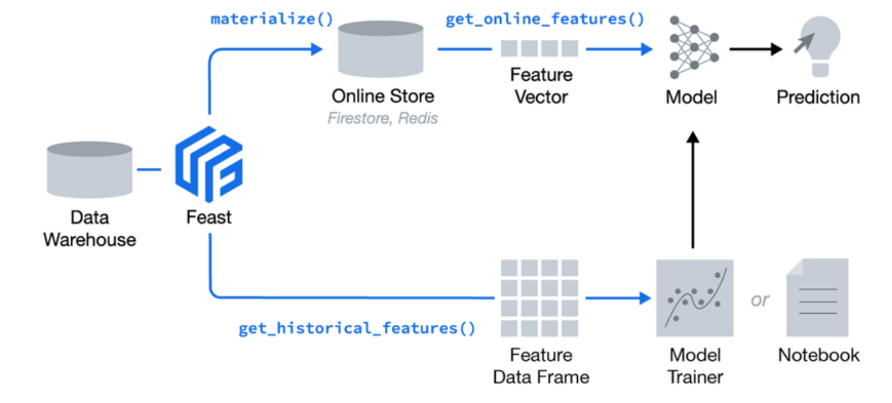
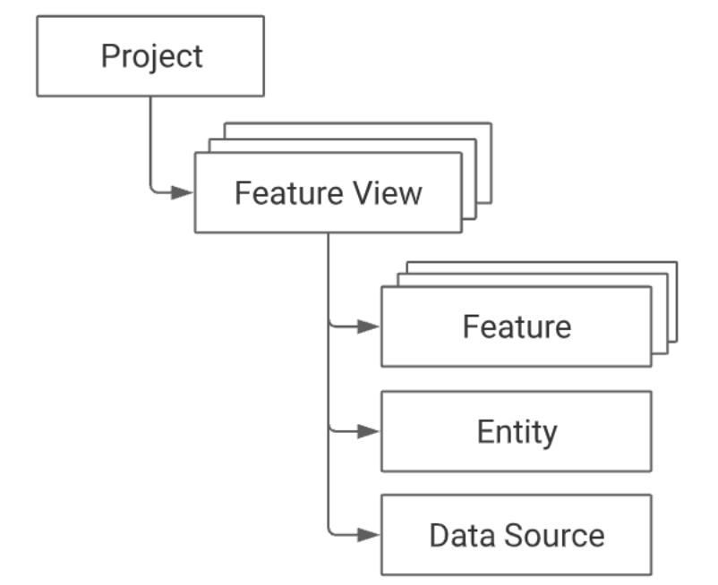
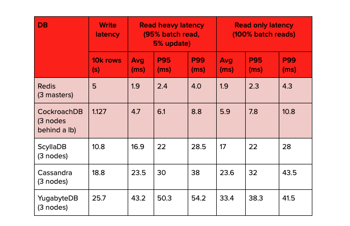
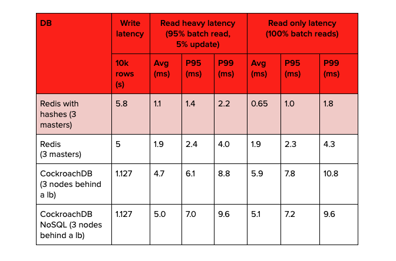

# Feast

* A centralized **data access layer** / **registry** 1) to share features among data scientists, 2) to decouple models from training / serving data, and 3) to store features transformed (ETL) from various data sources, e.g., databases, files, streams.

<p float="left">
    
</p>

## Example

1. Install `feast`, `scikit-learn` and `pyspark`:
```bash
python -m venv venv
source venv/bin/activate
pip install feast scikit-learn pyspark
```

2. Create a new feature repository:
```bash
feast init feature_repo
```

3. `feature_repo/example.py` defines the `FeatureView` with its primary key `Entity` and its data source `FileSource` as a `parquet` file.

<p float="left">
    
</p>

The key line defining the overall architecture of the feature store is the **provider**, which defines where the raw data exists 1) to generate feature values for training - `fs.get_historical_features()`, and 2) to generate feature values for serving - `fs.get_online_features()` after `feast materialize`

4. The `parquet` file `feature_repo/data/driver_stats.parquet` for `driver_id` 1001, 1002, 1003 looks like below:
```bash
$ pyspark
>>> df = spark.read.parquet('feature_repo/data/driver_stats.parquet')
>>> df.count()
1807
>>> df.filter(col('driver_id').isin([1001, 1002, 1003])).orderBy(col('event_timestamp').desc()).show(20, False)
+-------------------+---------+----------+-----------+---------------+-----------------------+
|event_timestamp    |driver_id|conv_rate |acc_rate   |avg_daily_trips|created                |
+-------------------+---------+----------+-----------+---------------+-----------------------+
|2022-04-08 22:00:00|1001     |0.31035125|0.25751528 |547            |2022-04-08 23:03:56.064|
|2022-04-08 22:00:00|1002     |0.7349448 |0.38520727 |564            |2022-04-08 23:03:56.064|
|2022-04-08 22:00:00|1003     |0.41785488|0.73344725 |664            |2022-04-08 23:03:56.064|
|2022-04-08 21:00:00|1003     |0.20334087|0.42899996 |337            |2022-04-08 23:03:56.064|
|2022-04-08 21:00:00|1001     |0.21019016|0.35344505 |563            |2022-04-08 23:03:56.064|
|2022-04-08 21:00:00|1002     |0.46654326|0.105620645|488            |2022-04-08 23:03:56.064|
|2022-04-08 20:00:00|1002     |0.93162274|0.56232756 |506            |2022-04-08 23:03:56.064|
|2022-04-08 20:00:00|1001     |0.67206717|0.058268722|870            |2022-04-08 23:03:56.064|
|2022-04-08 20:00:00|1003     |0.48833933|0.90321153 |453            |2022-04-08 23:03:56.064|
|2022-04-08 19:00:00|1001     |0.6174078 |0.4861378  |401            |2022-04-08 23:03:56.064|
|2022-04-08 19:00:00|1002     |0.21745539|0.2310649  |751            |2022-04-08 23:03:56.064|
|2022-04-08 19:00:00|1003     |0.16277416|0.054828346|545            |2022-04-08 23:03:56.064|
|2022-04-08 18:00:00|1002     |0.49418253|0.3146625  |526            |2022-04-08 23:03:56.064|
|2022-04-08 18:00:00|1001     |0.2823272 |0.40937448 |928            |2022-04-08 23:03:56.064|
|2022-04-08 18:00:00|1003     |0.41193905|0.9846903  |411            |2022-04-08 23:03:56.064|
|2022-04-08 17:00:00|1003     |0.9768525 |0.91717166 |311            |2022-04-08 23:03:56.064|
|2022-04-08 17:00:00|1001     |0.31879056|0.842283   |544            |2022-04-08 23:03:56.064|
|2022-04-08 17:00:00|1002     |0.17946923|0.38795444 |100            |2022-04-08 23:03:56.064|
|2022-04-08 16:00:00|1002     |0.67327964|0.45476618 |149            |2022-04-08 23:03:56.064|
|2022-04-08 16:00:00|1003     |0.23163705|0.48157763 |150            |2022-04-08 23:03:56.064|
+-------------------+---------+----------+-----------+---------------+-----------------------+
only showing top 20 rows
```

5. `feast apply` scans the current directory `feature_repo` for feature view / entity definitions, and registers the table schemas / data sources in the offline store `registry.db` and online store `online_store.db`:
```bash
cd feature_repo
feast apply

sqlite3 data/online_store.db

sqlite> .tables
feature_repo_driver_hourly_stats
sqlite> .schema feature_repo_driver_hourly_stats
CREATE TABLE feature_repo_driver_hourly_stats (entity_key BLOB, feature_name TEXT, value BLOB, event_ts timestamp, created_ts timestamp,  PRIMARY KEY(entity_key, feature_name));
CREATE INDEX feature_repo_driver_hourly_stats_ek ON feature_repo_driver_hourly_stats (entity_key);
```

6. Fetch the offline features to train the model - `get_historical_features`:
```bash
cd ..
python driver_ranking_training.py
```

```
----- Feature schema -----

<class 'pandas.core.frame.DataFrame'>
Int64Index: 3 entries, 720 to 1081
Data columns (total 6 columns):
 #   Column                              Non-Null Count  Dtype              
---  ------                              --------------  -----              
 0   driver_id                           3 non-null      int64              
 1   label_driver_reported_satisfaction  3 non-null      int64              
 2   event_timestamp                     3 non-null      datetime64[ns, UTC]
 3   conv_rate                           3 non-null      float32            
 4   acc_rate                            3 non-null      float32            
 5   avg_daily_trips                     3 non-null      int32              
dtypes: datetime64[ns, UTC](1), float32(2), int32(1), int64(2)
memory usage: 132.0 bytes
None

----- Example features -----

      driver_id  label_driver_reported_satisfaction                  event_timestamp  conv_rate  acc_rate  avg_daily_trips
720        1002                                   5 2022-04-08 21:13:23.920917+00:00   0.734945  0.385207              564
359        1001                                   1 2022-04-08 21:38:23.920871+00:00   0.310351  0.257515              547
1081       1003                                   3 2022-04-08 20:36:23.920925+00:00   0.417855  0.733447              664
```

7. Load the features into the online store:
```bash
cd feature_repo
CURRENT_TIME=$(date -u +"%Y-%m-%dT%H:%M:%S")
feast materialize-incremental $CURRENT_TIME
```

8. Fetch the online features for inference - `get_online_features`:
```bash
python driver_ranking_inference.py
```

```bash
----- Serving features with predictions -----

   driver_id  avg_daily_trips  conv_rate  acc_rate  prediction
0       1001              547   0.310351  0.257515         1.0
1       1002              564   0.734945  0.385207         5.0
2       1003              664   0.417855  0.733447         3.0

Prediction for best driver id: 1002
```

## Protobuf

`feature_repo/data/registry.db` contains the schemas of features, such as `feature_views`, `entities`, `data_sources`. `registry.db`'s own schema is defined in [Registry.proto](https://github.com/feast-dev/feast/blob/master/protos/feast/core/Registry.proto). 

Reading from `registry.db` is equal to reading from an instance of `FeatureStore`. The sample code is as below:

```bash
python protobuf.py 
```

`feast apply` executes [feature_store.apply()](https://github.com/feast-dev/feast/blob/master/sdk/python/feast/feature_store.py#L597), which will update `registry.db` for new or deleted schemas.

`feast materialize` executes [feature_store.materialize()](https://github.com/feast-dev/feast/blob/master/sdk/python/feast/feature_store.py#L1101), which will 1) load the features of the specified `feature_views` during the specified interval into the online store defined in `provider`, and 2) update `registry.db` for `materialization_intervals` in `meta`.

## Spark

To use `Spark` as offline store, `feature_store.yaml` is configured as below:

```yaml
project: spark_feature_repo
registry: data/registry.db
provider: local
online_store:
    path: data/online_store.db
offline_store:
    type: spark
    spark_conf:
        spark.master: "local[*]"
        spark.ui.enabled: "false"
        spark.eventLog.enabled: "false"
        spark.sql.catalogImplementation: "hive"
        spark.sql.parser.quotedRegexColumnNames: "true"
        spark.sql.session.timeZone: "UTC"
```

`data_source` is defined as below:

```python
from feast.infra.offline_stores.contrib.spark_offline_store.spark_source import SparkSource

driver_hourly_stats = SparkSource(
    table="driver_hourly_stats",
    event_timestamp_column="event_timestamp",
    created_timestamp_column="created",
)
```

With the following `pyspark` script, table `driver_hourly_stats` is created and persisted in `spark-warehouse`:

```python
df = spark.read.parquet("feature_repo/data/driver_stats.parquet")
df.write.saveAsTable('driver_hourly_stats')
```

Execute `feast apply`, the schemas will be saved in `registry.db`.

Note that `feature_store.get_historical_features()` and `feature_store.get_online_features()` don't work yet, which perform the `point-in-time join` for a single `feature_view` table to the provided `entity` table on `event_timestamp`. The source code can be referenced [here](https://github.com/feast-dev/feast/blob/master/sdk/python/feast/infra/offline_stores/contrib/spark_offline_store/spark.py).

## Benchmark

<p float="left">
    
    
</p>

## References

* https://docs.feast.dev/
* https://github.com/feast-dev/feast
* https://redis.com/blog/feast-with-redis-tutorial-for-machine-learning/
* https://doordash.engineering/2020/11/19/building-a-gigascale-ml-feature-store-with-redis/
* https://github.com/feast-dev/feast-gcp-driver-ranking-tutorial  
* https://github.com/feast-dev/feast-spark-examples
* https://github.com/feast-dev/feast/tree/master/sdk/python/feast
* https://github.com/feast-dev/feast/tree/master/protos/feast/core
* https://github.com/tintinrevient/protobuf
